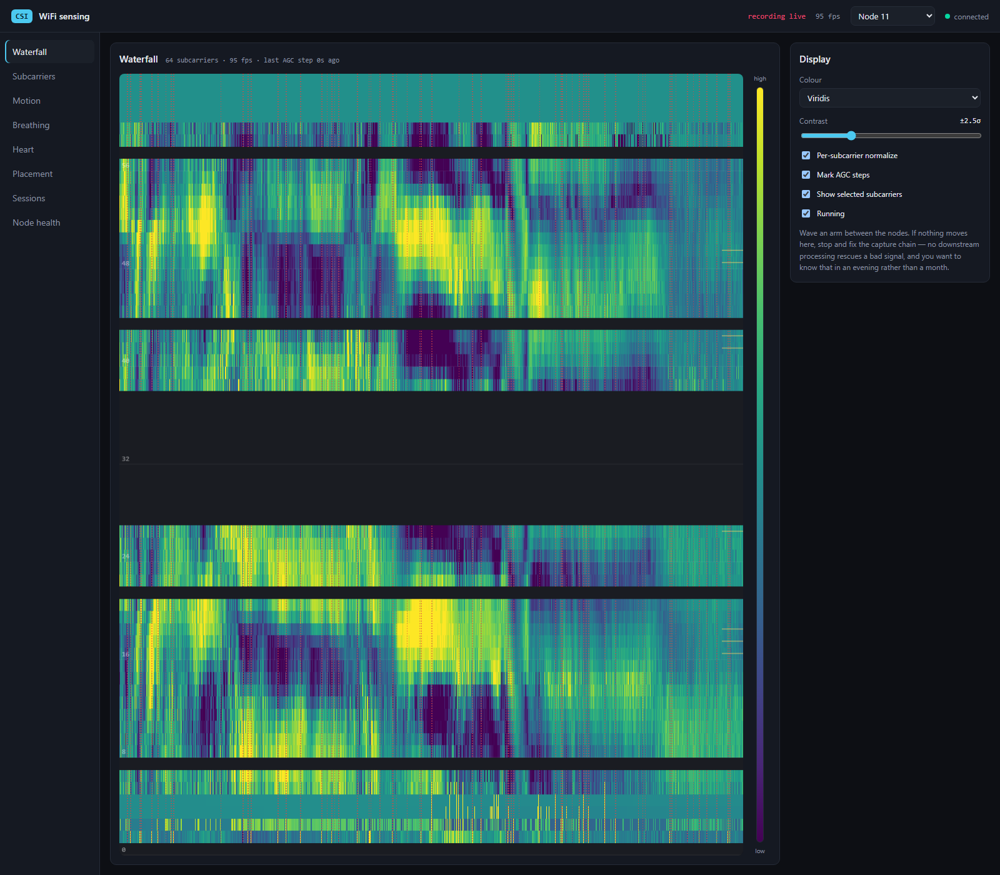
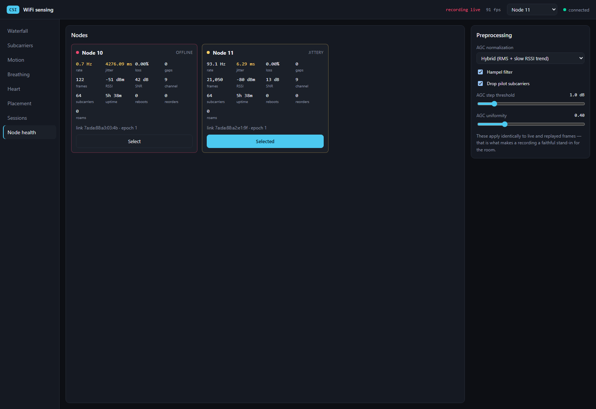
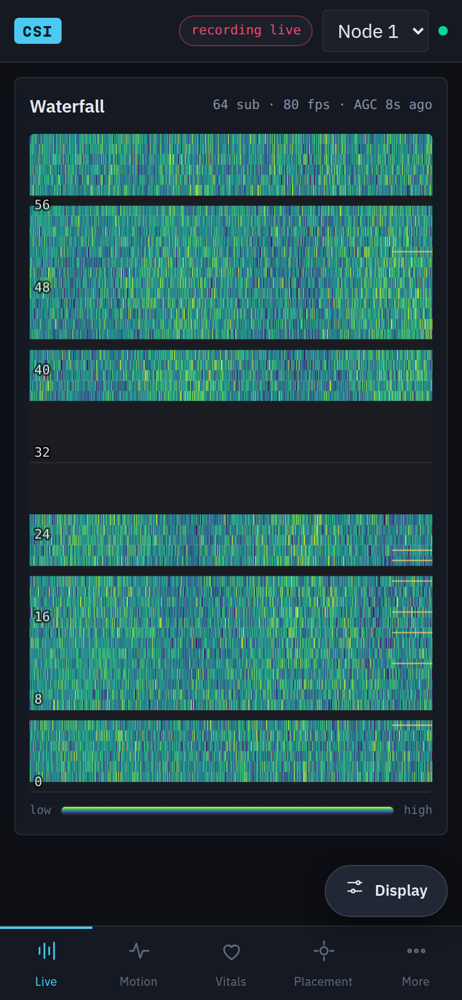

# WiFi CSI sensing

Capture Channel State Information from a single node — an ESP32 board or a Raspberry Pi —
stream it to a server, visualize and analyze it in a web app.

**Design principle: the pipeline is source-agnostic.** A frame is `(timestamp_us, node_id,
complex[N])` with `N` variable and explicit per frame. An ESP32 in HT20, the same board in HT40,
a Raspberry Pi running nexmon at 256 subcarriers, and a replayed public dataset are all just
producers into that format. Nothing downstream knows or cares which it is looking at.

```
   one node, either kind
   ┌──────────────────────────┐
   │  ESP32-S3 or ESP32       │ ─── probe, 100 Hz ───►  ┌─────────┐
   │  64 subcarriers, HT20    │                         │ your AP │
   │            or            │ ◄────── reply ────────  └─────────┘
   │  Raspberry Pi + nexmon   │     CSI callback on every reply
   │  up to 256 at 80 MHz     │
   └────────────┬─────────────┘
                │  CSI over UDP, one datagram per reply
                ▼
             server ───WebSocket───►  browser
             ingest                   waterfall
             record  ◄───replay───►   motion
             analyse                  breathing
```

**One node, doing both halves of the job.** It joins the WiFi you already have, sends a probe at
a fixed rate, and reports CSI for each reply — so it generates the traffic it measures. The link
it senses is the one between the node and the access point, and the sampling rate is a property
of the node rather than of the household's traffic. That last part is the whole point: a station
that only listens gets a CSI callback whenever the access point happens to address it, which on
an idle network is a few frames a second, and the spectrum you compute from that describes the
household's traffic pattern rather than the room.

Nothing above this line depends on which kind of node it is. Same 100 Hz, same uplink format,
same analysis, same views — an ESP32 and a Pi differ in how many subcarriers they resolve and in
which of their per-frame numbers are measured rather than synthesized, and in nothing else.

## The probe, and why it goes over UDP

The probe is a round trip through the server: the node sends a UDP datagram at 100 Hz to
`CSI_ECHO_PORT`, the server reflects it, and the reply is a downlink frame with CSI attached.
Both ends are ours, so the yield — CSI frames over probes sent — is exact, and every measurement
quoted below was taken this way.

The alternative is an ICMP ping to the gateway, which needs nothing running on the server but
puts the router in charge of your sample rate. On the consumer mesh hardware this was built
against, that failed badly: sustained 100 Hz probing made the router stop answering pings
altogether — the yield went to 0%, which reads exactly like a dead node — while it still answered
a laptop at 4 Hz. UDP echo restored it to 96%. Expect to need UDP on consumer mesh gear.

Two asymmetries to know about:

- **On the ESP32 the method is a build-time choice.** `CSI_PROBE_METHOD` in `menuconfig`
  defaults to ICMP; select `CSI_PROBE_UDP_ECHO` for the UDP path. The server needs
  `CSI_ECHO_PORT` set to match, and setting one without the other is the same silent collapse
  from either direction.
- **The Pi node probes by ICMP only.** `pi/csi_node.py` opens a raw ICMP socket and pings the
  default gateway; there is no UDP echo option there yet. If your access point rate-limits pings
  the way the mesh here did, that is the one place the two node types are not yet interchangeable.

Either way the CSI itself reaches the server over UDP, on `CSI_UDP_PORT`.

| Directory | What it is |
|---|---|
| `firmware/` | ESP-IDF project for the node. One image, three roles, and an on-device setup page. |
| `pi/` | The same job on a Raspberry Pi: nexmon_csi capture, same uplink format. |
| `server/` | Python: UDP ingest, echo responder, recorder, replayer, DSP, HTTP + WebSocket. |
| `web/` | TypeScript + canvas front end. No framework. Works on a phone, which is where the placement tuner belongs. |
| `docs/` | Wire formats. |
| `deploy/` | Container, compose and reverse-proxy configuration. |

## Quick start: one Raspberry Pi, doing everything

A Pi 3B+, 4, 5 or CM4 is a complete system on its own — sensor, server and UI in one box, with no
ESP32 involved. 64-bit Raspberry Pi OS:

```sh
curl -fsSL https://raw.githubusercontent.com/Saavuori/wifi-csi-app/main/install.sh | bash
```

One command, no flags, no questions about what you want: it builds a Pi that measures your actual
room. Both halves:

- **The capture, on the host.** Patches the BCM43455 with nexmon_csi and runs `csi-node.service`,
  listening on the access point's channel and forwarding to the server on `127.0.0.1`. It reports
  as **node 20**. The radio ends up in monitor mode and the Pi wants Ethernet — both for its own
  reachability and because that is where it provokes traffic from; see
  [`pi/README.md`](pi/README.md).
- **The server, in Docker.** Installs Docker if it is missing, raises `net.core.rmem_max`, pulls
  the arm64 image and starts it: UDP ingest, recorder, replayer, the DSP, and the web app —
  waterfall, subcarriers, motion, breathing, heart rate, placement, sessions and node health. Open
  `http://<pi>:8080`.

`--uninstall` reverses all of it. `--help` lists the rest. Details and the compose file are in
[`deploy/README.md`](deploy/README.md); what the Pi node does and does not measure is in
[`pi/README.md`](pi/README.md).

**Why the capture is not in a container.** Everything that can be containerized is. The capture
cannot: nexmon_csi replaces the firmware blob the kernel loads into the BCM43455, and on a Pi 5
it needs the 4 KB page kernel rather than the 16 KB one Raspberry Pi OS boots by default. Both
are properties of the host — a container shares the host's kernel and the host's radio and has no
firmware of its own to patch. So the node runs as `csi-node.service`, installed by the same
command, and `journalctl -u csi-node -f` is where its statistics go.

Budget 20-40 minutes for the nexmon build — it compiles a cross toolchain first — plus one reboot
on a Pi 5. The installer records the stage it reached, so running the same command again after
the reboot continues rather than starting over.

Two host settings the server container cannot do for itself, both handled by `install.sh` and
both worth knowing if you deploy by hand:

- **`net.core.rmem_max`.** The ingest socket asks for a 4 MB UDP receive buffer and Linux clamps
  `SO_RCVBUF` to this sysctl *silently*. The ~208 KB default overflows as sequence gaps with
  nothing in the logs to explain them.
- **Where `/data` lives.** A node at 80 Hz writes about 1 GB a day. On an SD card that is a wear
  problem as much as a capacity one — use a USB SSD, or run with `CSI_RECORD=false`. Recordings
  are deleted once they are older than `CSI_MAX_AGE_H` (24 h by default), which bounds the
  capacity side of that; the writes still happen, so the wear argument for an SSD stands.

### How many subcarriers you get

The count follows the width of the frames being measured — 256 at 80 MHz, 128 at 40, 64 at 20. A
Pi watching a 2.4 GHz network gives 64. If you want the full 256, point it at a 5 GHz network
running an 80 MHz channel and check what you actually got:

```sh
iw dev wlan0 info
```

Two things also come back at 20 MHz whatever the channel width, because broadcast and multicast
go out at the basic rate: beacons, and the node's own Ethernet stimulus. Those are trimmed to
their real 64 subcarriers rather than padded out with noise — see [`pi/README.md`](pi/README.md).

## Running the server somewhere other than a Pi

The server is ordinary Python and runs anywhere — the Pi install is that same server, packaged.
This is the path for front-end and analysis work, or for collecting from ESP32 nodes onto a
laptop:

```sh
python -m venv .venv && .venv/bin/pip install -e "server[dev]"
cd web && npm install && npm run build && cd ..

CSI_WEB_DIR=web/dist .venv/bin/python -m csi
```

Open <http://localhost:8080>, then point a node at this machine on port 5566 — an ESP32 from its
setup page, or a Pi node installed with `--server <your-ip>`. The Node health view shows it
arriving.

For front-end work, `cd web && npm run dev` proxies `/api` and `/ws` to the Python server on
8080 and gives you hot reload.

The server listens on all interfaces, so any device on the same network reaches it at
`http://<server-ip>:8080`. The front end is laid out for a phone as well as a desktop — same
views, same canvases, same numbers, with the sidebar becoming a bottom tab bar. That matters for
the Placement view in particular: it exists to be watched while you are across the room holding
the node, and the number it shows has to be the real one. On Windows the firewall usually needs
an inbound rule for the interpreter running the server.

## Quick start on Windows, with a node already configured

Same command, different path separator — the venv puts its interpreter in `Scripts\` rather than
`bin/`, and `python -m csi` is the same module either way:

```sh
CSI_WEB_DIR=web/dist CSI_ECHO_PORT=5568 .venv/Scripts/python.exe -m csi
```

Three things decide whether frames actually arrive, and each fails silently in its own way:

- **The server must listen on the address the node points at.** `CSI_SERVER_HOST` is baked into
  the image until you change it from the node's setup page, or `/etc/default/csi-node` on a Pi;
  check it against `ipconfig` before blaming the radio. There is no discovery and there is
  deliberately no fallback.
- **`CSI_ECHO_PORT` must be set when the node probes by UDP echo.** The node generates its own
  CSI by probing and reporting the reply, so with nothing answering the probes the rate collapses
  to whatever incidental traffic the link carries — about 0.1 Hz here, which looks exactly like a
  dead node without saying so. The responder is off unless the variable is set, because a port
  that reflects whatever it is sent should not be open unless something needs it. Leave it unset
  if the node probes by ICMP.
- **The wire version must match the node.** `CSI_WIRE_VERSION` is pinned on both ends — 2 as of
  the single-node topology — and the server rejects anything else, one `unsupported version N`
  warning per datagram. That log line is the diagnostic: the board is fine, the image is stale.

Measured here on 2026-07-31, with two ESP32 station nodes on the mesh probing by UDP echo: node
11 held **94.7 Hz with 0.00% loss and zero gaps over 26,471 frames**, 64 subcarriers, RSSI
−82 dBm, 5.2 ms jitter, no reboots and no roams. The waterfall reacts to an arm wave within a
frame or two, which is the phase-3 exit criterion.



The horizontal bands with no data are the guard and DC subcarriers — HT20 carries 64 bins but
only 52 of them are populated, so an empty stripe around index 32 is the format, not a fault. A
Pi node fills the same view with up to 256 rows and needs no change here; `n_sub` is per frame
and the layout tables are keyed on it.

Opening the page draws the last couple of minutes immediately rather than an empty plot —
the server hands over the ring it already keeps for the analyzers. The bar under the plot scrubs
back through what the browser is holding, which is minutes; going back further is what replaying
a recorded session is for.



Node 10 is the same link seen from the other mesh access point and idles below 1 Hz, so it shows
as offline. Selecting a node in the header is what picks the link the analysis runs on.

### On a phone



The same app, not a cut-down one: a phone gets the identical waterfall, the identical numbers and
the identical controls. Only the shell differs. The eight views become five tab-bar destinations
with the remaining three behind **More**, and each view's control column — the 320 px rail on the
desktop — becomes a bottom sheet opened by the pill above the tab bar. That last part is the
reason for the whole layout: as a column, the controls stacked *below* a full-height plot, which
put them off the bottom of the screen on arrival, and controls nobody scrolls to are controls
that do not exist.

This matters more here than in most apps, because the reason to hold the instrument on a phone at
all is that you are across the room moving the node — see the placement tuner — and the number
you walked over to read has to be the real one.

## Bringing up a node

Whichever kind, the sequence is the same, and step 3 is the one that decides what the system can
see at all.

1. **Point it at the server.** `CSI_SERVER_HOST` and `CSI_UDP_PORT`, from the setup page on an
   ESP32 or `/etc/default/csi-node` on a Pi. Give each node a distinct `CSI_NODE_ID`, or the
   server interleaves two rooms into one history.
2. **List the access points in range.** The ESP32's boot scan, or **Scan** on its setup page,
   reports every BSSID with channel and RSSI — on a mesh that is several, and the phone app does
   not show them to you. On a Pi, `sudo iw dev wlan0 scan | grep -E 'SSID|signal|^BSS'`.
3. **Pick the one whose line to the node crosses the doorway, bed or hallway you care about, and
   lock to its BSSID.** That choice is the placement decision. The system senses along that line;
   the node is one end of it and you do not get to move the other. It is not the strongest access
   point that wins, it is the one with the right geometry. The ESP32 locks from its setup page; a
   Pi locks at the supplicant, with `nmcli connection modify <name> wifi.bssid <MAC>` or a
   `bssid=` line in the wpa_supplicant block.
4. **Watch the Node health view** for a stable rate, sub-1% loss, and `roams` at zero. If `roams`
   climbs, the mesh is still moving the node between access points and every calibration dies
   with each move. Fix that before trusting anything downstream of it.
5. **Read the yield** — CSI frames over probes — in the node's own log: the serial statistics
   line on an ESP32, `journalctl -u csi-node` on a Pi. It is the number that tells you whether
   the access point is holding up its end, and a low yield with a healthy node looks identical to
   a dead node from the server side. If it collapses on an ESP32, switch the probe to UDP echo.

### An ESP32 node

Read [`firmware/README.md`](firmware/README.md) first — it lists the handful of settings that
decide whether the capture works at all, and why. Flash one board with your SSID and
`CSI_SERVER_HOST`, then do everything else from the setup page.

**Settings live on the node, not in the image.** After the first flash, the board serves a
settings page — at its own address on your network, printed at boot, and on a `csi-setup-xxxxxx`
network of its own when it cannot reach yours. Changing network, access point, server address or
probe rate needs no toolchain and no cable, and reflashing keeps what you saved.

The firmware runs on the original ESP32 as well as the S3: `firmware/sdkconfig.defaults.esp32`
carries the target and the 4 MB flash layout, and no C changes are needed. The two-board pair —
one flashed as a dedicated transmitter, giving a link nobody else touches — is still supported
and described in the firmware README, but one board is the default and the place to start.

### A Raspberry Pi node

[`pi/README.md`](pi/README.md) covers the install, the nexmon fork it needs, and which of its
per-frame numbers are measured rather than synthesized. In short: `install.sh` does it as part of
setting up the server, or point a Pi at a server elsewhere with

```sh
sudo pi/install-node.sh --server 192.168.1.10
```

The fork matters, though not for the reason it was written. It exists to keep the Wi-Fi
connection that upstream's procedure gives up — but with the CSI firmware loaded, an associated
BCM43455 receives no unicast data at all, so there is no connection left to keep and the Pi runs
in monitor mode regardless. What [the fork](https://github.com/Saavuori/nexmon_csi) still buys is
a build that targets the one firmware version the CSI patch supports and tooling that configures
the extractor without tearing the interface down. The measurements and the root cause are in
[`pi/README.md`](pi/README.md); the practical consequence is that a Pi node wants Ethernet.

What you give up against an ESP32: no radio-level timestamp (the kernel's `SO_TIMESTAMPNS`
instead), RSSI read from the driver once a second rather than per frame, and amplitude scaled per
frame — which removes the AGC step before the server can flag it. What you gain is four times the
frequency resolution, because the ESP32 is a 2.4 GHz radio and cannot go past HT40.

A Pi Zero, Zero 2 W or original 3B carries a different chip and cannot do this at all.

## Where settings live

Three surfaces, and it is worth knowing which one owns what:

| | Where | Covers |
|---|---|---|
| Server | Environment variables, and `deploy/compose.yaml` on a Pi | Ports, data directory, recording, analysis rate. Table below |
| ESP32 node | The setup page the board serves itself | SSID, password, BSSID lock, server address, node id, probe rate. Survives reflashing |
| Pi node | `/etc/default/csi-node`, then `systemctl restart csi-node` | Server address and port, node id, interface, probe target and rate. The association itself — including a BSSID lock — belongs to NetworkManager |

The web app has no configuration view of its own — per-view controls like the breathing window
length are on the views they affect, and everything structural is in the three places above.

## The phases

Numbered as in the build plan.

| Phase | Where | State |
|---|---|---|
| 1 — Firmware | `firmware/` | Implemented and **run on hardware**: 96–99 Hz, zero sequence gaps, 96–100% probe yield. The ring and wire layout also have host tests. See the measurements in `firmware/README.md` |
| 1b — Raspberry Pi node | `pi/` | Firmware builds, installs and loads on a Pi 4 (Debian 13, kernel 6.12); `wlan0` stays associated at 80 MHz. **Live capture is blocked** — `nexutil` cannot reach the firmware on this kernel, so the extractor is never configured and no frames are emitted. See [`pi/README.md`](pi/README.md#known-limitation-nexutil-cannot-reach-the-firmware) |
| 2 — Ingest + recorder | `server/csi/{ingest,recorder,replay,sessions}.py` | Implemented and tested |
| 3 — Waterfall | `web/src/views/waterfall.ts` | Implemented |
| 4 — Motion + presence | `server/csi/dsp/{presence,selection}.py` | Implemented and tested |
| 5 — Breathing | `server/csi/dsp/vitals.py` | Implemented and tested |
| 6 — Heart rate | same, different band | Implemented; expect it to work only at close range on a motionless subject |

### Exit criteria, and how to check them

- **Phase 1** — "stable ~80 Hz, sequence gaps under 1% over ten minutes, node stays cool."
  The first two are on the Node health view, measured continuously from device timestamps. With
  a single node the rate is only as steady as the access point's willingness to answer, so read
  it alongside the yield in the node's own statistics log: a rate of 60 Hz at a 100 Hz probe
  rate is the link being busy, not the node being slow. Met on hardware: 94.7 Hz and 0.00% loss
  across 26,471 frames, on a board that had been up 5h38m with no reboots. The ten-minute soak
  and the thermal check are still worth doing on a node you intend to leave running.
- **Phase 2** — "a recording replays byte-identically through the live pipeline." This is a
  property of the format rather than something to keep re-testing: recordings store the raw
  datagrams, and the replayer hands the same bytes to the same parser the UDP listener uses.
  Asserted by `test_replay_is_byte_identical_to_what_was_recorded`.
- **Phase 3** — "wave your arm; if the waterfall does not visibly react, stop and fix the
  capture chain."
- **Phase 4** — "flags presence/absence across the empty-room and walking recordings with no
  manual retuning between them." Asserted by `test_flags_presence_without_retuning`.

## What the analysis actually does

The parts worth knowing about before trusting a number:

**AGC removal comes first.** The receiver's automatic gain control steps every few seconds, and
when it does every subcarrier's amplitude jumps by the same factor at once — indistinguishable
from major motion to a raw variance detector. Two independent defenses: normalize the frame
against reported power, and flag the transition using its uniformity signature (a large change
that is *uniform across subcarriers* is the receiver; real motion is frequency-selective).
Flagged frames are excluded from variance accumulation, not merely rescaled. This is the one step
that does not fire on Pi frames, because the node has already scaled the step away.

**Subcarrier selection is a gate, then a rank.** Ranking by raw variance promotes deep-fade
carriers whose variance is thermal noise. Ranking by mean-over-variance is worse — it is
maximized by a carrier that never changes. So: drop the bottom quantile by mean amplitude
(low magnitude *is* the fade signature), then rank by a metric specific to the task —
`var_occupied / var_baseline` for motion, in-band-over-out-of-band power for breathing.

**Window length dominates the breathing estimate.** Published MAE goes from 0.61 breaths/min at
a 1 s window to 0.09 at 20 s. It is a slider in the UI because the effect is large enough to
watch happen.

**A hole in the stream is refused, not interpolated over.** `np.interp` cannot fail: hand it a
window with two seconds missing and it draws a straight line across, returns an array of exactly
the right length, and says nothing. A ramp lasting seconds has its fundamental in the 0.1–0.5 Hz
respiration band, so the estimator that follows produces a confident number describing the
network. Windows whose largest gap exceeds 0.5 s are declined with a reason instead. This is the
failure mode a node sharing an access point has and a dedicated transmitter pair does not.

**Everything is computed server-side, identically for live and replayed frames.** That is what
makes a recording a faithful stand-in for the room, and it is why the recorder exists before
any of the analysis does.

## Two things measured during development

Both are commented at the code that depends on them, and both were found by running the
pipeline rather than by reading it:

- The subcarrier ranker needs Welch segments that **resolve** the band, not merely cover it.
  Welch's default segmenting gives ~0.2 Hz bins against a 0.4 Hz-wide breathing band, which
  puts the whole band in two bins and makes the ranking a coin flip.
- The smoothed-RSSI time constant must sit well **below** the respiration band. An EMA does not
  remove RSSI's 1 dB quantization noise, it low-pass filters it — so a 3 s time constant parks
  the residual at 0.33 Hz, directly on top of the breathing peak. Moving it to 30 s took
  synthetic breathing MAE from 1.70 to 0.29 breaths/min.

## Tests

```sh
.venv/bin/python -m pytest server/tests      # 129 tests
.venv/bin/python -m pytest pi/tests          # 46 tests, no Pi needed
firmware/scripts/run_host_tests.sh           # ring buffer + wire layout, no hardware needed
cd web && npm run build                      # typecheck + bundle
```

`check.sh` runs all four.

The Pi tests are worth a note: they build synthetic nexmon packets, push them through the node,
and parse the result with the *server's* protocol module. The node holds a third copy of the
uplink header, alongside the ESP32's C and the server's Python, and that round trip is what stops
it drifting from the other two.

All four run in CI on every push, and the container image is built for amd64 and arm64 only
after they pass — see [`.github/workflows/ci.yml`](.github/workflows/ci.yml).

## Configuration

Server environment variables, all optional:

| Variable | Default | Notes |
|---|---|---|
| `CSI_UDP_PORT` | 5566 | Where nodes send frames |
| `CSI_UDP_HOST` | `0.0.0.0` | Nodes are on the LAN, so this has to be reachable from outside the host |
| `CSI_HTTP_PORT` | 8080 | API and web app |
| `CSI_HTTP_HOST` | `0.0.0.0` | Set to `127.0.0.1` behind a reverse proxy; there is no authentication |
| `CSI_ECHO_PORT` | unset | Opens the UDP echo responder the probe bounces off. Off by default: a port that reflects whatever it is sent should not be open unless something needs it |
| `CSI_DATA_DIR` | `./data` | Recordings and `sessions.json` |
| `CSI_WEB_DIR` | `../web/dist` | Built front end; unset serves the API only |
| `CSI_RECORD` | `true` | Auto-start a recording at boot. Losing a session is far more expensive than the disk — a node at 80 Hz writes about 1 GB/day |
| `CSI_MAX_AGE_H` | 24 | How long a recording is kept. Age is measured from the *end* of a recording, so an overnight run survives while any part of it is still inside the window. `0` disables |
| `CSI_ROLL_H` | 1 | How often the always-on `live` recording is closed and a new one started. This is what lets the age limit apply to it at all — one endless session never finishes. Hand-started captures never roll. `0` disables |
| `CSI_MAX_DISK_GB` | 8 | Cap on the recordings directory, applied after the age rule as a backstop. `0` disables |
| `CSI_HISTORY_S` | 120 | In-memory history per node. Also how far back the waterfall can be scrubbed on a freshly opened browser, since it is what backfills the view |
| `CSI_RATE_HZ` | 80 | Expected frame rate, used for ring sizing and the health view's baseline |
| `CSI_METRICS_HZ` | 5 | Analysis rate. Runs whether or not a browser is connected |
| `CSI_NODE_TIMEOUT_S` | 5 | Silence after which a node reads as offline |

There is no authentication on the UDP port — anything that can reach it can inject frames. On a
home LAN that is fine; over the open internet it is not, and the answer is a tunnel rather than
adding a shared secret to a device with no operator.

## What this will and won't do

**Will:** motion detection, room-level presence, breathing rate at tuned positions, an overnight
activity record, a genuinely nice CSI visualization tool.

**Won't:** localization, direction, reliable multi-person counting, pose. Those need multiple
antennas on one radio or a much denser mesh. Single-link amplitude-only is one scalar view of
the room.

**The link is shared.** The far end is an access point serving the whole house, so the sample
rate and the reply yield depend on how busy it is. Expect Phase 1's "gaps under 1%" to be harder
to hit in the evening than at 3 a.m., and read the yield next to the rate. A second ESP32 —
flashed as a transmitter, giving a link nobody else touches — remains the answer if that turns
out to matter, and the pipeline already supports it: nothing in the format or the analysis knows
how many nodes there are.

Two separate ESP32s do **not** give CSI-ratio benefits. That trick cancels carrier frequency
offset because both antennas share one oscillator; separate boards have independent clocks.
This is an amplitude-only system throughout — there is no phase unwrapping anywhere, on purpose.

**A mesh is not only a cost.** Several access points on one SSID means several candidate sensing
lines through the house, and you get to pick which one by choosing the BSSID to lock to. A
second node later, locked to a *different* access point, adds a second line for the price of a
board — the server has been multi-node since the first commit, and the two need not be the same
kind of hardware.

**Deferred upgrades:** HT40 for 128 subcarriers on the ESP32, and a plane reflector behind the
PIFA. Both drop into the same ingest format without touching the web app — `n_sub` is per-frame
and the subcarrier layout tables are keyed on it.

## Reference material

- Ma, Zhou & Wang — *WiFi Sensing with Channel State Information: A Survey*, ACM CSUR 52(3), 2019
- Kocheta, Bhatia & Obraczka — *PulseFi*, arXiv:2510.24744, 2025 — source of the filter parameters
- Wang et al. — *Human respiration detection with commodity WiFi devices*, UbiComp 2016 — Fresnel zones
- Zeng et al. — *FarSense*, IMWUT 2019 — the CSI-ratio model this hardware cannot use
- Strohmayer & Kampel — *Directional Antenna Systems for Long-Range Through-Wall HAR*, arXiv:2401.01388
- Hernandez & Bulut — *WiFi Sensing on the Edge*, IEEE COMST 2022
- `espressif/esp-csi`, `StevenMHernandez/ESP32-CSI-Tool`, `seemoo-lab/nexmon_csi`
